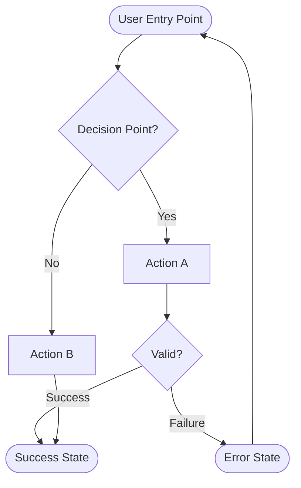
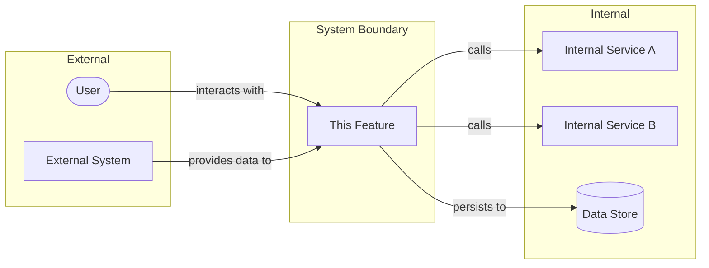
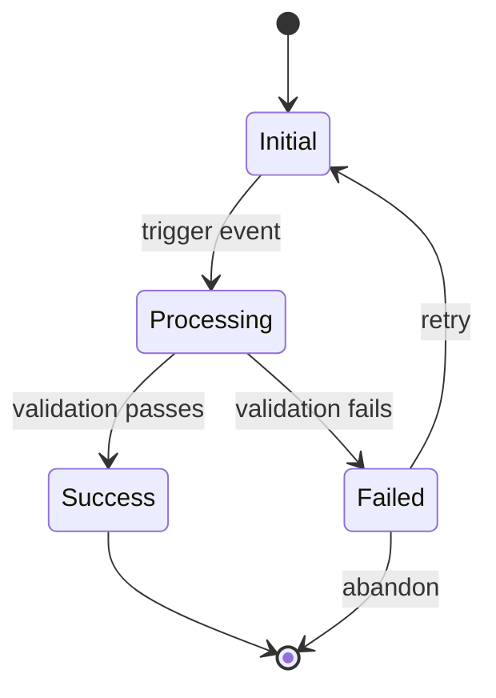
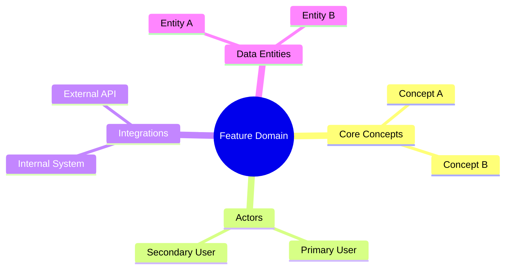

Take any list of requeriments in a requeriments.md document that must be save in docs/requeriments.md
These requeriments.md document must be follow the patterns and best pratices below.
don't try to read any document in docs/done.

# Requirements Specification: [Feature Name]
## Metadata

| Field        | Value                          |
|--------------|--------------------------------|
| ID           | REQ-[YYYYMMDD]-[NNN]           |
| Version      | [x.y.z]                        |
| Status       | [Draft / In Review / Approved / Deprecated] |
| Priority     | [Critical / High / Medium / Low] |
| Author       | [Name]                         |
| Reviewers    | [Names]                        |
| Created      | [YYYY-MM-DD]                   |
| Last Updated | [YYYY-MM-DD]                   |

---

## 1. Executive Summary & Problem Statement

### 1.1 Context

[Describe the current state of the system or business process. What exists today? What is the environment in which this feature will operate? Provide 2-3 sentences of background.]

### 1.2 Problem

[Articulate the specific pain point or gap. Be precise about who is affected and how. Avoid solution language here — focus purely on the problem.]

### 1.3 Goal

[State the desired outcome in measurable terms. What does success look like? How will we know the problem is solved?]

### 1.4 Business Value

[Explain why this matters to the organization. Connect to business metrics: revenue, cost reduction, user satisfaction, compliance, risk mitigation, etc.]

---

## 2. User Personas & Scenarios

### 2.1 Primary Actor: [Persona Name]

| Attribute       | Description                              |
|-----------------|------------------------------------------|
| Role            | [e.g., End User, Administrator, API Consumer] |
| Goals           | [What they want to achieve]              |
| Pain Points     | [Current frustrations relevant to this feature] |
| Technical Level | [Novice / Intermediate / Expert]         |

### 2.2 Secondary Actors

| Actor Name | Role | Interaction Type |
|------------|------|------------------|
| [Name]     | [Role] | [Direct / Indirect / System] |

### 2.3 Critical Scenarios (Gherkin Syntax)

#### Scenario 1: [Happy Path Name]

```gherkin
Feature: [Feature Name]

  Scenario: [Descriptive scenario name]
    Given [precondition state]
      And [additional precondition if needed]
    When [user performs action]
      And [additional action if needed]
    Then [expected outcome]
      And [additional verification if needed]
```

#### Scenario 2: [Alternative Path Name]

```gherkin
Feature: [Feature Name]

  Scenario: [Descriptive scenario name]
    Given [precondition state]
    When [user performs action]
    Then [expected outcome]
```

#### Scenario 3: [Error Path Name]

```gherkin
Feature: [Feature Name]

  Scenario: [Error condition name]
    Given [precondition state]
    When [user performs invalid action]
    Then [system responds with error]
      And [user is informed appropriately]
```

---

## 3. Functional Requirements

| Req ID  | User Story / Function                  | Acceptance Criteria                          | Priority |
|---------|----------------------------------------|----------------------------------------------|----------|
| FR-001  | [As a ... I want ... so that ...]      | [Specific, measurable, testable criterion]   | [P0/P1/P2] |
| FR-002  | [Function description]                 | [Criterion]                                  | [P0/P1/P2] |
| FR-003  | [Function description]                 | [Criterion]                                  | [P0/P1/P2] |

### 3.1 Detailed Functional Specifications

#### FR-001: [Requirement Title]

**Description:** [Expanded explanation of the requirement]

**Input:** [What data/actions trigger this function]

**Processing:** [Business rules that apply — without specifying implementation]

**Output:** [Expected result or system state change]

---

## 4. Non-Functional Requirements

| NFR ID  | Category     | Requirement                    | Metric / Constraint           |
|---------|--------------|--------------------------------|-------------------------------|
| NFR-001 | Performance  | [e.g., Response time]          | [e.g., < 200ms p95]           |
| NFR-002 | Scalability  | [e.g., Concurrent users]       | [e.g., 10,000 simultaneous]   |
| NFR-003 | Availability | [e.g., Uptime]                 | [e.g., 99.9% SLA]             |
| NFR-004 | Security     | [e.g., Data protection]        | [e.g., Encryption at rest]    |
| NFR-005 | Compliance   | [e.g., Regulatory standard]    | [e.g., GDPR Article 17]       |
| NFR-006 | Usability    | [e.g., Accessibility]          | [e.g., WCAG 2.1 AA]           |
| NFR-007 | Tech Stack   | [e.g., Language constraint]    | [e.g., [Language] [Version]]  |

---

## 5. Visual Specifications

### 5.1 User Flow Diagram



### 5.2 System Context Diagram



### 5.3 State Diagram (if applicable)



### 5.4 Domain Model (Mindmap)



---

## 6. Data Requirements

### 6.1 Input Data Specifications

| Data Element  | Type     | Format / Constraints           | Source          | Required |
|---------------|----------|--------------------------------|-----------------|----------|
| [Field Name]  | [Type]   | [e.g., Max 255 chars, regex]   | [User / System] | [Y/N]    |

### 6.2 Output Data Specifications

| Data Element  | Type     | Format / Constraints           | Destination     |
|---------------|----------|--------------------------------|-----------------|
| [Field Name]  | [Type]   | [e.g., ISO 8601 datetime]      | [UI / API / DB] |

---

## 7. Problem-Solution Integrity Matrix

| Problem Statement (from Section 1) | Proposed Requirement (Req ID) | Validation Method                  | Success Metric              |
|------------------------------------|-------------------------------|------------------------------------|-----------------------------|
| [User pain point]                  | FR-001, FR-002                | [How we verify solution works]     | [Quantitative measure]      |
| [Business gap]                     | FR-003, NFR-001               | [Validation approach]              | [Target metric]             |

---

## 8. Assumptions & Constraints

### 8.1 Assumptions

| ID   | Assumption                                      | Impact if Invalid                    |
|------|-------------------------------------------------|--------------------------------------|
| A-01 | [Something assumed to be true]                  | [What happens if assumption fails]   |
| A-02 | [Another assumption]                            | [Impact]                             |

### 8.2 Constraints

| ID   | Constraint                                      | Rationale                            |
|------|-------------------------------------------------|--------------------------------------|
| C-01 | [Technical or business limitation]              | [Why this constraint exists]         |
| C-02 | [Another constraint]                            | [Rationale]                          |

---

## 9. Dependencies

| Dep ID | Dependency Description             | Type            | Owner       | Status      |
|--------|------------------------------------|-----------------|-------------|-------------|
| D-01   | [What this feature depends on]     | [Upstream / Downstream / External] | [Team/Person] | [Ready / Blocked / In Progress] |

---

## 10. Out of Scope

| Item                          | Rationale for Exclusion                        | Future Consideration |
|-------------------------------|------------------------------------------------|----------------------|
| [Feature or capability X]     | [Why it's not included in this iteration]      | [Yes / No / TBD]     |
| [Feature or capability Y]     | [Rationale]                                    | [Yes / No / TBD]     |

---

## 11. Glossary

| Term          | Definition                                                  |
|---------------|-------------------------------------------------------------|
| [Domain Term] | [Clear definition in the context of this feature]           |
| [Acronym]     | [Expansion and explanation]                                 |

---

## 12. Open Questions

| ID   | Question                                        | Owner       | Due Date   | Resolution |
|------|-------------------------------------------------|-------------|------------|------------|
| Q-01 | [Unresolved question needing clarification]     | [Person]    | [Date]     | [Pending / Resolved: answer] |

---

## 13. Appendix

### 13.1 Reference Documents

| Document Name | Location / Link | Relevance                          |
|---------------|-----------------|-------------------------------------|
| [Doc Name]    | [URL or Path]   | [How it relates to this feature]    |

### 13.2 Wireframes / Mockups

[Include links to visual designs or embed simple ASCII representations if applicable]

---