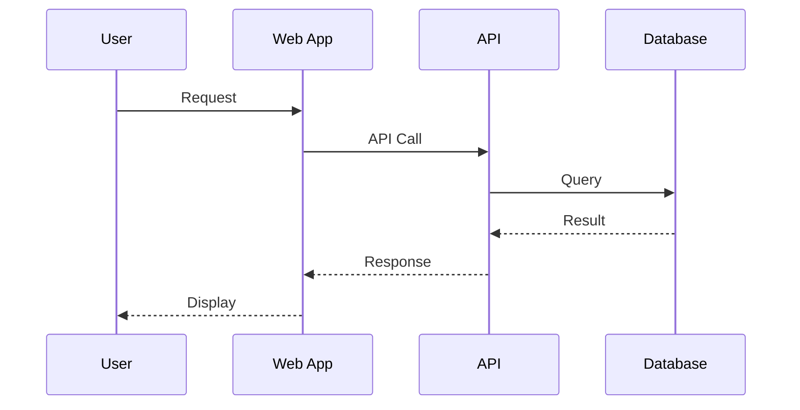

# Tools Recommendation

This guide covers recommended tools for creating and maintaining architectural documentation.

---

## Diagrams as Code (Preferred)

Store diagram source in version control alongside code. This approach offers:

- **Version control** — Track changes over time
- **Review process** — Include diagrams in pull requests
- **Automation** — Generate diagrams in CI/CD
- **Consistency** — Enforce standards through tooling

### PlantUML

Best for UML diagrams with C4 support through plugins.

| Aspect | Details |
|--------|---------|
| **Best For** | UML diagrams, C4 (with plugin) |
| **Integration** | IDE plugins, CI/CD |
| **Format** | Text-based DSL |
| **Output** | PNG, SVG, ASCII |

**Example:**

```plantuml
@startuml
!include C4_Container.puml

Person(user, "User", "A user of the system")
System_Boundary(system, "My System") {
    Container(web, "Web App", "React", "Frontend")
    Container(api, "API", "Spring Boot", "Backend")
    ContainerDb(db, "Database", "PostgreSQL", "Storage")
}

Rel(user, web, "Uses")
Rel(web, api, "Calls")
Rel(api, db, "Reads/Writes")
@enduml
```

### Mermaid

Best for flowcharts, sequence diagrams, and ERDs with native GitHub/GitLab support.

| Aspect | Details |
|--------|---------|
| **Best For** | Flowcharts, sequence, ERD |
| **Integration** | GitHub/GitLab native rendering |
| **Format** | Text-based DSL |
| **Output** | SVG (rendered in markdown) |

**Example:**



### Structurizr

Purpose-built for C4 diagrams.

| Aspect | Details |
|--------|---------|
| **Best For** | C4 model specifically |
| **Integration** | DSL, cloud service, self-hosted |
| **Format** | Structurizr DSL |
| **Output** | PNG, SVG, PlantUML, Mermaid |

**Example:**

```
workspace {
    model {
        user = person "User"
        system = softwareSystem "My System" {
            webapp = container "Web App" "React"
            api = container "API" "Spring Boot"
            db = container "Database" "PostgreSQL"
        }

        user -> webapp "Uses"
        webapp -> api "Calls"
        api -> db "Reads/Writes"
    }

    views {
        container system {
            include *
            autolayout lr
        }
    }
}
```

### D2

Modern diagramming language with aesthetic output.

| Aspect | Details |
|--------|---------|
| **Best For** | Modern, aesthetic diagrams |
| **Integration** | CLI, CI/CD friendly |
| **Format** | D2 language |
| **Output** | SVG, PNG |

**Example:**

```d2
user: User {
  shape: person
}

system: My System {
  webapp: Web App
  api: API
  db: Database {
    shape: cylinder
  }

  webapp -> api: Calls
  api -> db: Reads/Writes
}

user -> system.webapp: Uses
```

---

## Visual Tools

For collaborative or ad-hoc diagramming.

### Draw.io (diagrams.net)

| Aspect | Details |
|--------|---------|
| **Best For** | All-purpose diagramming |
| **Cost** | Free |
| **Storage** | Local, Google Drive, GitHub |
| **Collaboration** | Limited (file-based) |

**Strengths:**
- Extensive shape libraries
- Export to multiple formats
- VS Code extension available
- Can be stored in git as XML

### Lucidchart

| Aspect | Details |
|--------|---------|
| **Best For** | Team collaboration |
| **Cost** | Paid (free tier available) |
| **Storage** | Cloud |
| **Collaboration** | Real-time |

**Strengths:**
- Real-time collaboration
- Comments and feedback
- Integration with Confluence, Jira
- Templates and shape libraries

### Miro

| Aspect | Details |
|--------|---------|
| **Best For** | Workshops, brainstorming |
| **Cost** | Paid (free tier available) |
| **Storage** | Cloud |
| **Collaboration** | Real-time |

**Strengths:**
- Infinite canvas
- Sticky notes and voting
- Workshop facilitation features
- Great for architecture discussions

### Excalidraw

| Aspect | Details |
|--------|---------|
| **Best For** | Hand-drawn style diagrams |
| **Cost** | Free |
| **Storage** | Local, cloud |
| **Collaboration** | Real-time |

**Strengths:**
- Informal, approachable style
- Quick sketching
- VS Code extension
- Good for early design discussions

---

## Specialized Tools

For specific documentation needs.

### dbdiagram.io

| Aspect | Details |
|--------|---------|
| **Purpose** | ERD specifically |
| **Format** | DBML (Database Markup Language) |
| **Output** | Visual diagram, SQL |

**Example:**

```dbml
Table users {
  id integer [primary key]
  email varchar
  created_at timestamp
}

Table orders {
  id integer [primary key]
  user_id integer [ref: > users.id]
  status varchar
  created_at timestamp
}
```

### Swagger / OpenAPI

| Aspect | Details |
|--------|---------|
| **Purpose** | REST API documentation |
| **Format** | YAML/JSON |
| **Tools** | Swagger UI, ReDoc, Stoplight |

**Example:**

```yaml
openapi: 3.0.0
info:
  title: My API
  version: 1.0.0
paths:
  /users:
    get:
      summary: List users
      responses:
        '200':
          description: Success
```

### AsyncAPI

| Aspect | Details |
|--------|---------|
| **Purpose** | Event-driven API documentation |
| **Format** | YAML/JSON |
| **Tools** | AsyncAPI Studio |

**Example:**

```yaml
asyncapi: 2.0.0
info:
  title: My Events
  version: 1.0.0
channels:
  user/created:
    publish:
      message:
        payload:
          type: object
          properties:
            userId:
              type: string
```

### Backstage

| Aspect | Details |
|--------|---------|
| **Purpose** | Developer portal |
| **Features** | Service catalog, docs, templates |
| **Best For** | Large organizations with many services |

---

## Tool Selection Guide

### By Team Size

| Team Size | Recommended Tools |
|-----------|-------------------|
| 1-5 developers | Mermaid, Draw.io, dbdiagram.io |
| 5-20 developers | PlantUML, Structurizr, Lucidchart |
| 20+ developers | Structurizr, Backstage, enterprise tools |

### By Use Case

| Use Case | Recommended Tool |
|----------|------------------|
| Quick sketch | Excalidraw |
| C4 diagrams | Structurizr, PlantUML |
| Sequence diagrams | Mermaid, PlantUML |
| ERD | dbdiagram.io, Mermaid |
| API docs | OpenAPI/Swagger |
| Event docs | AsyncAPI |
| Workshop | Miro, Excalidraw |
| Enterprise catalog | Backstage |

### By Repository Integration

| Need | Recommended Tool |
|------|------------------|
| GitHub rendering | Mermaid |
| GitLab rendering | Mermaid, PlantUML |
| CI/CD generation | PlantUML, Structurizr, D2 |
| VS Code editing | Draw.io, Mermaid, PlantUML |

---

## Best Practices

### Do

- **Store source in git** — Version control your diagrams
- **Automate generation** — Generate images in CI/CD
- **Use consistent tools** — Team should use same tools
- **Keep tools simple** — Prefer text-based for longevity

### Don't

- **Don't use proprietary formats** — Avoid vendor lock-in
- **Don't over-complicate** — Simple tools often suffice
- **Don't neglect maintenance** — Outdated diagrams mislead
- **Don't create silos** — Make diagrams discoverable
