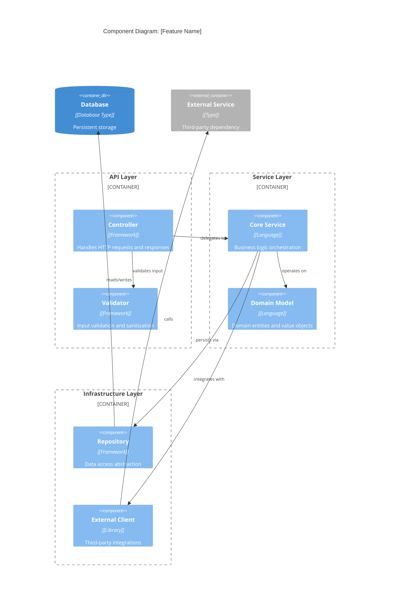
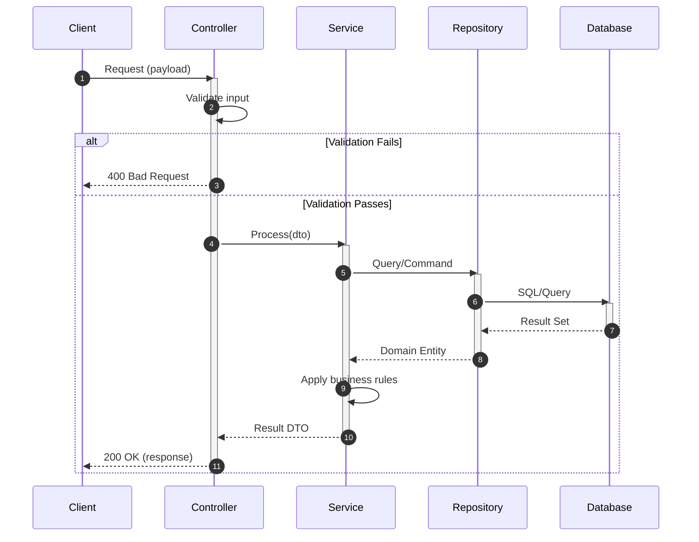
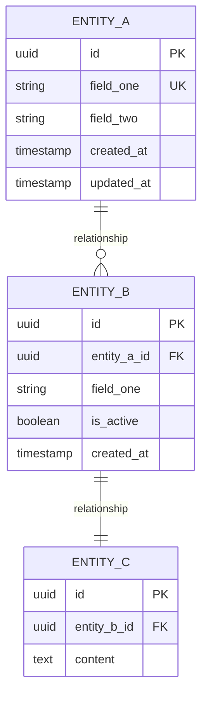

# Implementation Plan: [Feature Name]

## Metadata

| Field             | Value                              |
|-------------------|------------------------------------|
| Plan ID           | PLAN-[YYYYMMDD]-[NNN]              |
| Requirements Ref  | [Link to requirements.md]          |
| Version           | [x.y.z]                            |
| Status            | [Draft / Proposed / Approved / In Progress / Completed] |
| Target Architecture | [e.g., Microservices, Monolith, Serverless] |
| Author            | [Name]                             |
| Reviewers         | [Names]                            |
| Created           | [YYYY-MM-DD]                       |
| Last Updated      | [YYYY-MM-DD]                       |

---

## 1. Technical Approach & Architecture

### 1.1 Strategy Overview

[Provide a high-level summary of the engineering approach. Explain the architectural pattern chosen and why it fits the requirements. This should be 2-3 paragraphs that give an AI agent clear context about the overall direction.]

### 1.2 Architectural Decisions

| Decision ID | Decision                           | Rationale                              | Alternatives Considered     |
|-------------|------------------------------------|----------------------------------------|-----------------------------|
| AD-01       | [e.g., Use event-driven pattern]   | [Why this approach was chosen]         | [What else was considered]  |
| AD-02       | [e.g., Separate read/write models] | [Rationale]                            | [Alternatives]              |

### 1.3 Component Diagram (C4 Level 3)



### 1.4 Sequence Diagram: Primary Flow



---

## 2. Technology Stack & Dependencies

### 2.1 Core Technologies

| Category        | Technology       | Version    | Justification                         |
|-----------------|------------------|------------|---------------------------------------|
| Language        | [Language]       | [x.y.z]+   | [Why this language]                   |
| Framework       | [Framework]      | [x.y.z]+   | [Why this framework]                  |
| Database        | [Database]       | [x.y.z]+   | [Why this database]                   |
| Build Tool      | [Tool]           | [x.y.z]+   | [Why this tool]                       |
| Testing         | [Framework]      | [x.y.z]+   | [Why this testing framework]          |

### 2.2 Libraries & Dependencies

| Library         | Version    | Purpose                               | License     |
|-----------------|------------|---------------------------------------|-------------|
| [Library Name]  | [x.y.z]    | [Specific purpose in this feature]    | [License]   |
| [Library Name]  | [x.y.z]    | [Purpose]                             | [License]   |

### 2.3 Development Tools

| Tool            | Purpose                               |
|-----------------|---------------------------------------|
| [Tool Name]     | [How it's used in development]        |

---

## 3. Data Architecture

### 3.1 Entity Relationship Diagram



### 3.2 Schema Definitions

| Entity    | Field        | Type         | Constraints                    | Index  |
|-----------|--------------|--------------|--------------------------------|--------|
| EntityA   | id           | UUID         | PK, NOT NULL                   | PK     |
| EntityA   | field_one    | VARCHAR(255) | UNIQUE, NOT NULL               | UNIQUE |
| EntityA   | field_two    | VARCHAR(100) | NOT NULL                       | -      |
| EntityA   | created_at   | TIMESTAMP    | NOT NULL, DEFAULT NOW()        | -      |
| EntityB   | id           | UUID         | PK, NOT NULL                   | PK     |
| EntityB   | entity_a_id  | UUID         | FK -> EntityA.id, NOT NULL     | INDEX  |

### 3.3 Data Validation Rules

| Entity    | Field        | Validation Rules                              |
|-----------|--------------|-----------------------------------------------|
| EntityA   | field_one    | [e.g., Email format, max 255 chars]           |
| EntityA   | field_two    | [e.g., Alphanumeric only, min 3 chars]        |

### 3.4 Data Migration Strategy

[Describe how existing data will be migrated, if applicable. Include rollback strategy.]

---

## 4. API Contract (if applicable)

### 4.1 Endpoints Overview

| Method | Endpoint              | Description                    | Request Body | Response     |
|--------|-----------------------|--------------------------------|--------------|--------------|
| POST   | /api/v1/[resource]    | Create new resource            | CreateDTO    | ResourceDTO  |
| GET    | /api/v1/[resource]/{id} | Retrieve resource by ID      | -            | ResourceDTO  |
| PUT    | /api/v1/[resource]/{id} | Update existing resource     | UpdateDTO    | ResourceDTO  |
| DELETE | /api/v1/[resource]/{id} | Delete resource              | -            | 204 No Content |

### 4.2 Request/Response Schemas

#### CreateDTO

```
{
  "field_one": "[type] - [description] - [constraints]",
  "field_two": "[type] - [description] - [constraints]"
}
```

#### ResourceDTO

```
{
  "id": "[type] - [description]",
  "field_one": "[type] - [description]",
  "field_two": "[type] - [description]",
  "created_at": "[type] - ISO 8601 timestamp",
  "updated_at": "[type] - ISO 8601 timestamp"
}
```

### 4.3 Error Responses

| Status Code | Error Code        | Description                    | When Returned               |
|-------------|-------------------|--------------------------------|-----------------------------|
| 400         | VALIDATION_ERROR  | Invalid request payload        | Input validation fails      |
| 401         | UNAUTHORIZED      | Authentication required        | Missing/invalid credentials |
| 403         | FORBIDDEN         | Insufficient permissions       | User lacks required role    |
| 404         | NOT_FOUND         | Resource does not exist        | ID not in database          |
| 409         | CONFLICT          | Resource state conflict        | Duplicate or version conflict |
| 500         | INTERNAL_ERROR    | Unexpected server error        | Unhandled exception         |

---

## 5. Directory Structure

```
src/
├── [module]/
│   ├── api/
│   │   ├── controllers/
│   │   │   └── [Feature]Controller.[ext]    # HTTP request handlers
│   │   ├── dto/
│   │   │   ├── [Feature]CreateDTO.[ext]     # Input DTOs
│   │   │   └── [Feature]ResponseDTO.[ext]   # Output DTOs
│   │   └── validators/
│   │       └── [Feature]Validator.[ext]     # Input validation
│   │
│   ├── domain/
│   │   ├── entities/
│   │   │   └── [Entity].[ext]               # Domain entities
│   │   ├── valueobjects/
│   │   │   └── [ValueObject].[ext]          # Value objects
│   │   └── exceptions/
│   │       └── [Feature]Exception.[ext]     # Domain exceptions
│   │
│   ├── service/
│   │   ├── [Feature]Service.[ext]           # Business logic
│   │   └── [Feature]ServiceImpl.[ext]       # Implementation
│   │
│   └── infrastructure/
│       ├── repository/
│       │   ├── [Entity]Repository.[ext]     # Repository interface
│       │   └── [Entity]RepositoryImpl.[ext] # Repository implementation
│       └── client/
│           └── [External]Client.[ext]       # External service clients
│
├── config/
│   └── [Feature]Config.[ext]                # Feature configuration
│
└── tests/
    ├── unit/
    │   ├── service/
    │   │   └── [Feature]ServiceTest.[ext]   # Service unit tests
    │   └── domain/
    │       └── [Entity]Test.[ext]           # Domain unit tests
    │
    └── integration/
        ├── api/
        │   └── [Feature]ControllerIT.[ext]  # API integration tests
        └── repository/
            └── [Entity]RepositoryIT.[ext]   # Repository integration tests
```

---

## 6. Implementation Phases

### Phase 1: Foundation

**Goal:** Establish the data layer and domain model.

**Deliverables:**
- Domain entities and value objects
- Database schema and migrations
- Repository interfaces and implementations

**Entry Criteria:**
- Requirements approved
- Tech stack confirmed

**Exit Criteria:**
- Database schema deployed to dev environment
- Domain entities compile without errors
- Repository basic CRUD operations functional

**Verification Command:** `[build/migration command]`

---

### Phase 2: Core Logic

**Goal:** Implement business logic with comprehensive unit tests.

**Deliverables:**
- Service layer implementation
- Business rule validation
- Unit tests with >80% coverage on service layer

**Entry Criteria:**
- Phase 1 completed
- Domain model stable

**Exit Criteria:**
- All business rules implemented per requirements
- Unit tests passing
- Code review completed

**Verification Command:** `[test command]`

---

### Phase 3: API Layer

**Goal:** Expose functionality via API endpoints.

**Deliverables:**
- Controller implementations
- Request/Response DTOs
- Input validation
- API documentation

**Entry Criteria:**
- Phase 2 completed
- Service layer tested

**Exit Criteria:**
- All endpoints functional
- Integration tests passing
- API documentation generated

**Verification Command:** `[integration test command]`

---

### Phase 4: Integration & Hardening

**Goal:** Complete integrations and production readiness.

**Deliverables:**
- External service integrations
- Error handling and logging
- Performance optimizations
- Security review completion

**Entry Criteria:**
- Phase 3 completed
- External service credentials available

**Exit Criteria:**
- End-to-end flow verified
- Non-functional requirements met
- Security review passed

**Verification Command:** `[e2e test command]`

---

## 7. Requirements Traceability Matrix

| Req ID  | Requirement Description         | Implementation Component(s)           | Test Case ID(s)      | Status    |
|---------|---------------------------------|---------------------------------------|----------------------|-----------|
| FR-001  | [From requirements.md]          | [Service.method(), Controller]        | TC-001, TC-002       | [Pending / In Progress / Done] |
| FR-002  | [From requirements.md]          | [Component]                           | TC-003               | [Status]  |
| NFR-001 | [From requirements.md]          | [Component]                           | TC-PERF-001          | [Status]  |

---

## 8. Risk Assessment & Mitigation

| Risk ID | Risk Description                | Probability | Impact | Mitigation Strategy                    | Contingency Plan           |
|---------|--------------------------------|-------------|--------|----------------------------------------|----------------------------|
| R-01    | [Technical risk]               | [High/Med/Low] | [High/Med/Low] | [Proactive steps to reduce risk] | [If risk materializes]     |
| R-02    | [Integration risk]             | [H/M/L]     | [H/M/L] | [Mitigation]                          | [Contingency]              |
| R-03    | [Dependency risk]              | [H/M/L]     | [H/M/L] | [Mitigation]                          | [Contingency]              |

---

## 9. External Dependencies & Integrations

| Dependency        | Type        | Failure Mode              | Impact                  | Fallback / Circuit Breaker       |
|-------------------|-------------|---------------------------|-------------------------|----------------------------------|
| [Service Name]    | [API/DB/Queue] | [e.g., Service unavailable] | [What breaks]          | [e.g., Retry with backoff, cache] |
| [Database]        | [Type]      | [e.g., Connection timeout] | [Impact]               | [Fallback strategy]              |

---

## 10. Testing Strategy

### 10.1 Test Pyramid

| Level         | Scope                          | Tools              | Coverage Target |
|---------------|--------------------------------|--------------------|-----------------|
| Unit          | Individual classes/methods     | [Framework]        | >80%            |
| Integration   | Component interactions         | [Framework]        | >60%            |
| E2E           | Full user flows                | [Framework]        | Critical paths  |
| Performance   | Load and stress testing        | [Tool]             | NFR thresholds  |

### 10.2 Test Data Strategy

[Describe how test data will be managed: fixtures, factories, seeding, etc.]

---

## 11. Observability & Operations

### 11.1 Logging

| Log Level | When to Use                              | Example                           |
|-----------|------------------------------------------|-----------------------------------|
| ERROR     | Unexpected failures requiring attention  | Database connection failure       |
| WARN      | Potential issues, degraded operation     | Retry attempt on external call    |
| INFO      | Significant business events              | User created, order placed        |
| DEBUG     | Detailed troubleshooting information     | Request/response payloads         |

### 11.2 Metrics

| Metric Name               | Type      | Description                        |
|---------------------------|-----------|------------------------------------|
| [feature]_requests_total  | Counter   | Total requests to feature          |
| [feature]_latency_seconds | Histogram | Request latency distribution       |
| [feature]_errors_total    | Counter   | Error count by type                |

### 11.3 Health Checks

| Check Name     | Endpoint         | What It Validates                  |
|----------------|------------------|------------------------------------|
| Readiness      | /health/ready    | Service can accept traffic         |
| Liveness       | /health/live     | Service is running                 |
| Database       | /health/db       | Database connectivity              |

---

## 12. Security Considerations

| Concern                | Mitigation                              | Verification Method            |
|------------------------|-----------------------------------------|--------------------------------|
| [e.g., SQL Injection]  | [e.g., Parameterized queries]           | [e.g., SAST scan, code review] |
| [e.g., Auth bypass]    | [e.g., JWT validation middleware]       | [e.g., Security test cases]    |

---

## 13. Open Technical Decisions

| ID    | Decision Needed                          | Options                        | Owner   | Due Date | Resolution |
|-------|------------------------------------------|--------------------------------|---------|----------|------------|
| TD-01 | [Technical question requiring decision]  | [A, B, C]                      | [Name]  | [Date]   | [Pending / Decided: option] |

---
